# Engenharia de Machine Learning [25E1_3]
Instituto Infnet<br>
Aluno Luiz Tokuhara<br>
Professor Felipe F. Grael

## Projeto
Prever se o arremesso de Kobe Bryant foi convertido em cesta.


Tipos de dados.<br>
* 11 colunas do tipo object;<br>
* 17 colunas do tipo int64;<br>
* 3 colunas do tipo float64;<br>
* Target - Coluna shot_made_flag<br><br>
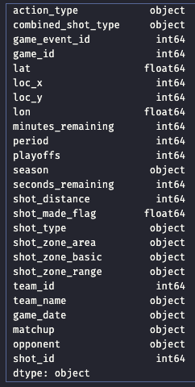


Histograma<br>
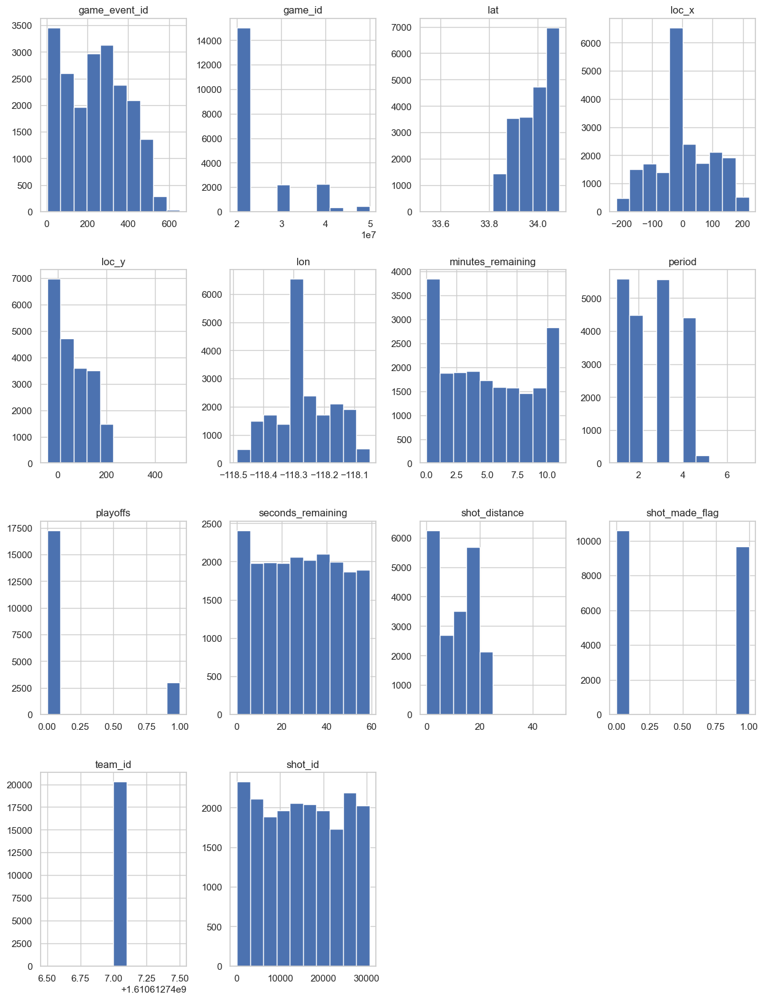


Zonas de arremesso<br>
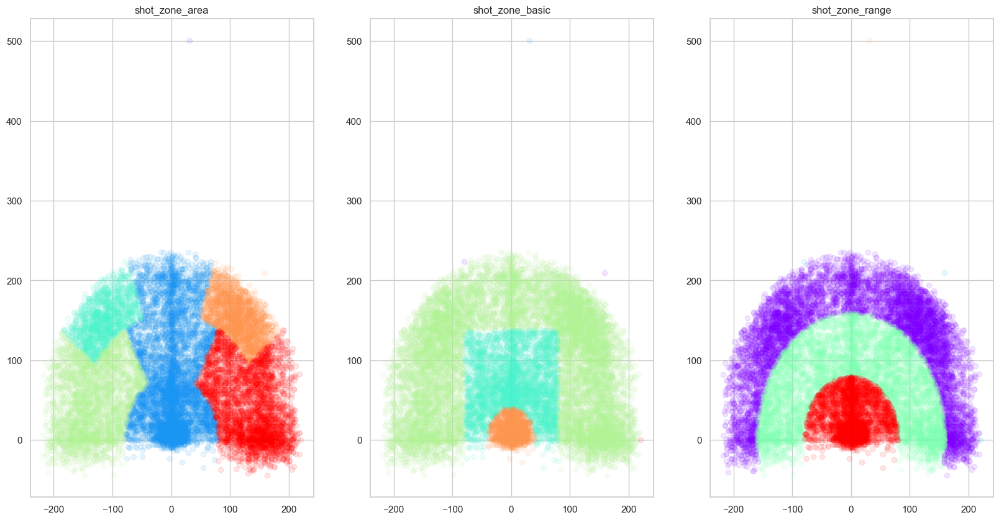


Posição do arremesso e cestas convertidas<br>
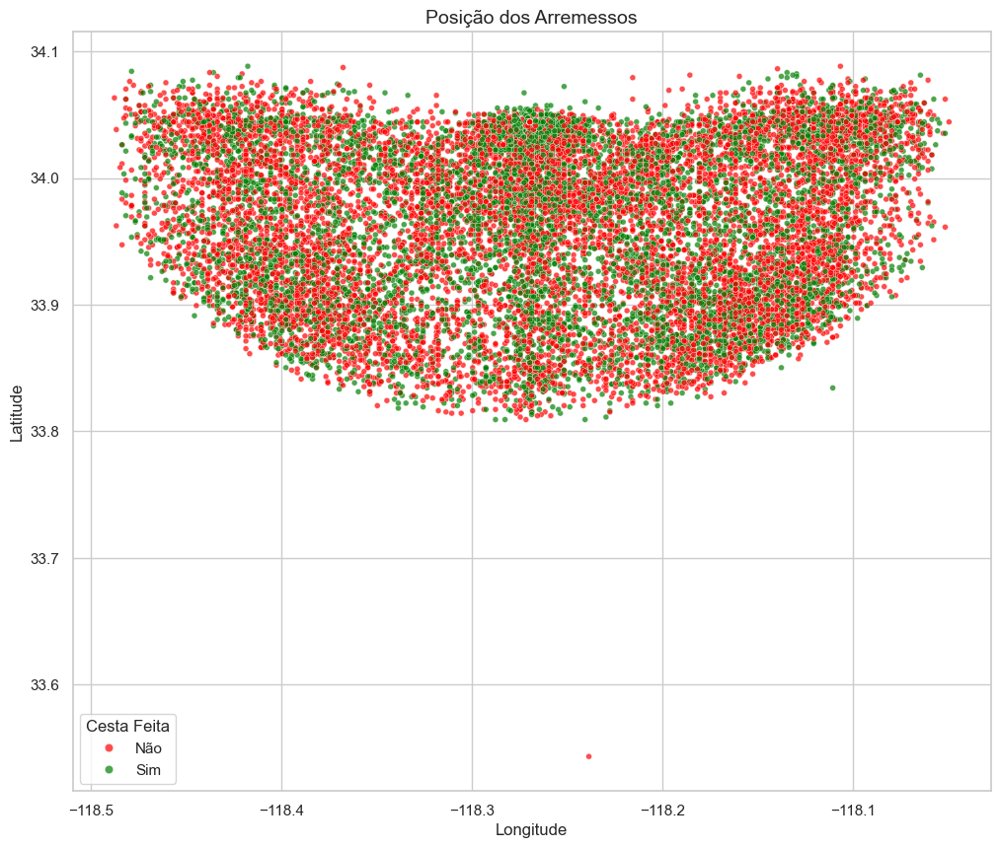

## Estrutura

Projeto criado com framework Kedro.
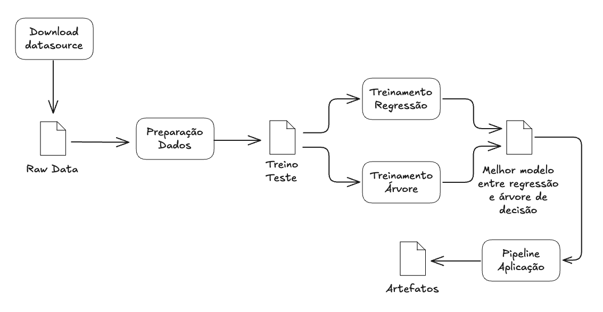


* **`Download Datasource`** Pipeline para download dos arquivos parquet;
* **`Raw data`** Arquivos parquet salvos na pasta data/01_raw;
* **`Preparação Dados`** Pipeline para filtragem dos dados (excluir linhas com valores nulos), seleção das features e separação em dois arquivos, treino (80%) e teste (20%). As métricas referentes a separação dos dados serão salvos no MLFlow;
* **`Treino / Teste`** Arquivos parquet para uso no treinamento dos modelos salvos na pasta data/processed;
* **`Treinamento Regressão`** Pipeline de treinamento do modelo de Regressão Logística utilizando PyCaret, métricas do treinamento serão salvas no MLFlow;
* **`Treinamento Árvore de Decisão`** Pipeline do modelo de Árvore de Decisão utilizando PyCaret, métricas do treinamento serão salvas no MLFlow;
* **`Melhor Modelo`** Escolha do melhor modelo baseado nas métricas salvas no MLFlow, o modelo será promovido no dashboard do MLFlow;
* **`Pipeline Aplicação`** Pipeline para inferência do melhor modelo contra a base de dados de produção, as inferências serão salvas em arquivo parquet na pasta data/processed e métricas no MLFlow;
* **`Artefatos`** Arquivo parquet com os dados da inferência do melhor modelo contra a base de produção (y_true, y_predicted), savo na pasta data/processed.


## Como as ferramentas Streamlit, MLFlow, PyCaret e Scikit-Learn auxiliam na construção dos pipelines

Rastreamento de experimentos:

* **`MLFlow`** Ferramenta central para rastreamento de experimentos. Permite registrar parâmetros, métricas e artefatos (como gráficos ou modelos) de cada execução. Com o MLFlow Tracking, você pode comparar diferentes runs, avaliar hiperparâmetros e identificar o melhor modelo com base em métricas.

* **`Pycaret`** Simplifica o rastreamento ao automatizar a comparação de modelos. Ele gera tabelas comparativas com métricas de desempenho (ex.: precisão, recall) para múltiplos algoritmos testados, facilitando a análise sem configuração manual extensa.

* **`Scikit-Learn`** Pode ser integrado ao MLFlow para logar métricas e parâmetros manualmente durante o treinamento.

* **`Streamlit`** Pode ser usado para criar dashboards interativos que exibem os resultados rastreados pelo MLFlow ou PyCaret.

Funções de treinamento:

* **`MLFlow`** Integra-se ao Scikit-Learn e PyCaret para registrar os modelos treinados e seus hiperparâmetros, funcionando como um "gerenciador" do processo.

* **`Pycaret`** Automatiza e acelera o treinamento ao oferecer funções de alto nível (ex.: ``setup()``, ``compare_models()``), que configuram automaticamente o ambiente e testam vários modelos do Scikit-Learn e outras bibliotecas, otimizando o processo.

* **`Scikit-Learn`** É a base para funções de treinamento, oferecendo algoritmos robustos (regressão, classificação, clustering) e ferramentas para pré-processamento (normalização, encoding).

Monitoramento da Saúde do Modelo:

* **`Feature Drift`** Ocorre quando a distribuição estatística das variáveis de entrada muda ao longo do tempo. Isso pode acontecer por diversos motivos, como mudanças nos dados de entrada, erros na coleta de dados ou mudanças nos hábitos dos usuários. Pode ser detectado utilizando técnicas como KS-Test (Kolmogorov-Smirnov Test).

* **`Concept Drift`** Ocorre quando a relação entre as variáveis de entrada e a variável-alvo muda ao longo do tempo. Ou seja, o que antes era uma boa predição agora não é mais. Pode ser detectado utilizando técnicas como o monitoramento contínuo da acurácia e F1-score.

* **`Model Drift`** Ocorre quando o modelo perde desempenho ao longo do tempo devido a mudanças nos dados ou no conceito que ele aprendeu. Pode ser detectado com o monitoramento contínuo de métricas do modelo (acurácia, loss, F1-score, etc).

Atualização de Modelo:

* **`MLFlow`** Facilita a atualização ao gerenciar versões de modelos no Model Registry. Você pode registrar um novo modelo treinado, compará-lo com o anterior e promovê-lo para produção.

* **`Pycaret`** Suporta a re-treino de modelos com novos dados usando ``finalize_model()`` ou ``tune_model()``, simplificando ajustes e otimizações antes de uma atualização.

* **`Streamlit`** Pode criar interfaces para acionar atualizações manuais ou automáticas, exibindo os resultados e permitindo interação com o processo.
<br><br>

## Com base no diagrama realizado, aponte os artefatos que serão criados ao longo de um projeto. Para cada artefato, a descrição detalhada de sua composição.

* **`Raw Data`** Dados crus (originais, sem alteração);
* **`Treino / Teste`** Dataframe em parquet com os dados filtrados (eliminação de colunas com dados nulos), separação das features para treinamento e split em treino (80%) e teste (20%) em 2 arquivos.
* **`Melhor modelo`** Modelos salvos baseados no treinamento da Regressão Logística e Árvore de Decisão para a escolha do melhor modelo.
* **`Artefatos`** Artefato (arquivo parquet) com o teste utilizando os dados de produção (y_true x predict) e log das métricas no MLFlow.
<br><br>

## Dimensão do dataset após seleção de features e remoção das linhas com dados nulos.
* **`(20285, 7)`** Linhas: 20.285 / Colunas: 7
<br><br>

## Métricas treino / teste
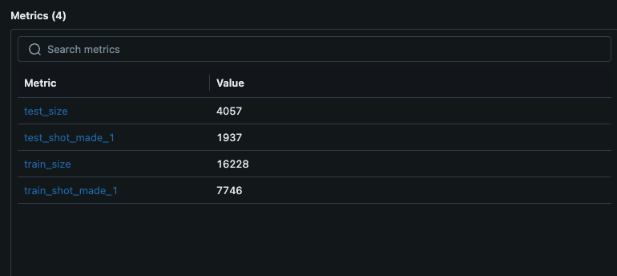
<br><br>

## Registro das métricas log loss e F1
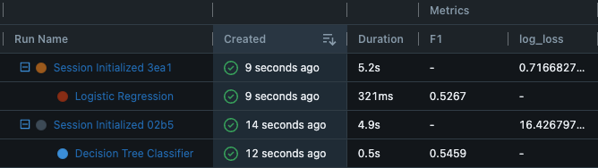
<br><br>

## Registro dos modelos no MLFlow
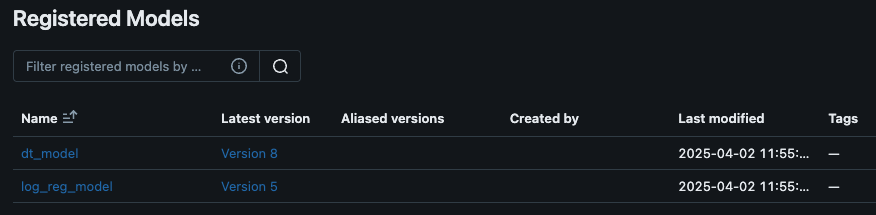
<br><br>

## Registros Pipeline Aplicação
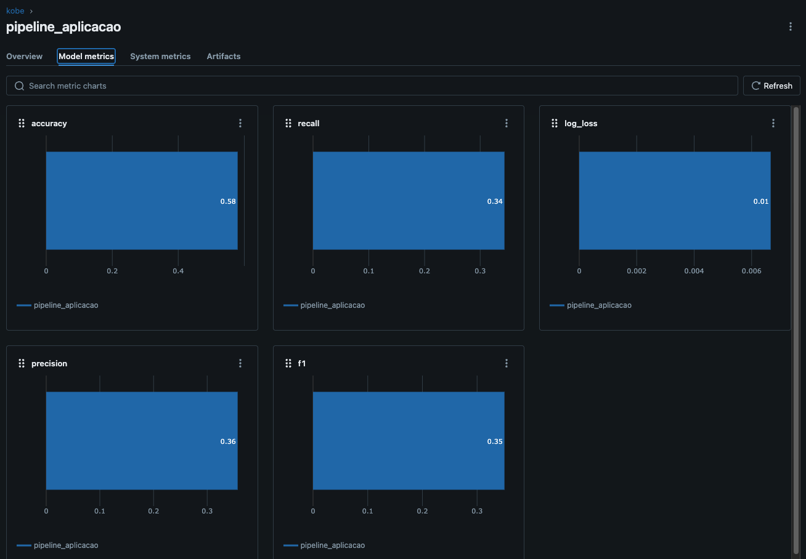
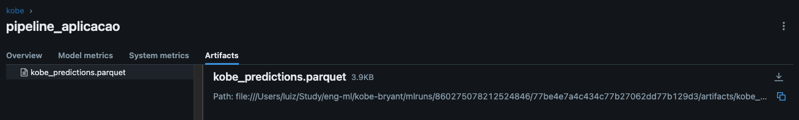
<br><br>

## Predição via Streamlit
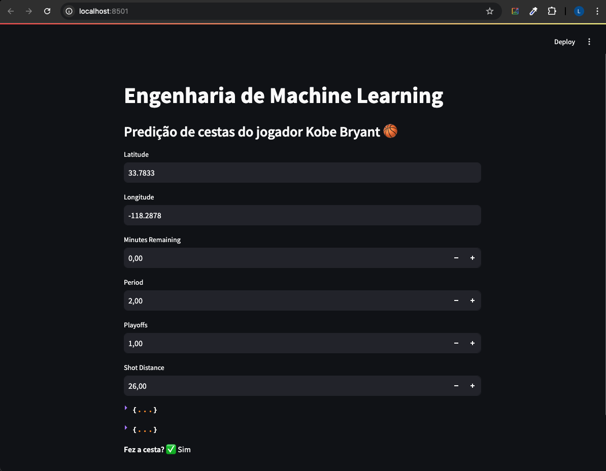
<br><br>


## Conclusões

#### * **`O modelo é aderente a essa nova base?`**<br>
Não, os dados de produção não são aderentes a base utilizada para treino e teste. O resultado foi um modelo enviesado que possui baixa acurácia nos dados de produção.<br><br>
#### * **`Descreva como podemos monitorar a saúde do modelo no cenário com e sem a disponibilidade da variável resposta para o modelo em operação`**
Com a variável reposta podemos podemos avaliar diretamente o desempenho do modelo utilizando as métricas, como: Acurácia, F1-score, ROC-AUC e etc. Se a acurácia ou o F1-score caírem abaixo de um limiar, pode ser sinal de Concept Drift ou Model Drift.
<br><br>
Sem a variável reposta precisamos usar métodos indiretos para avaliar a saúde do modelo como: Monitoramento de Feature Drift, Monitoramento de distribuições das previsões, Monitoramento da incerteza nas previsões.
<br><br>
#### * **`Descreva as estratégias reativa e preditiva de retreinamento para o modelo em operação.`**
Retreino do modelo, ajuste de hiperparâmetros, monitoramento contínuo, ajuste de pipeline de dados, coleta amostral para revalidação, revisão da entrada de dados, e etc.
<br><br>

## Como rodar o projeto
1 - Instalar as dependências:

```
pip install -r requirements.txt
```

2 - Inicializar o MLFlow Dashboard:

```
mlflow server --host 0.0.0.0 --port 5500
```

3 - Inicializar o MLFlow Model Server

```
mlflow models serve -m models:/log_reg_model/{versao_do_modelo} -p 5600
```
Em caso de problemas com o ambiente Miniconda:
```
export PATH="/opt/miniconda3/envs/seu_ambiente/bin:$PATH" 
mlflow models serve -m models:/log_reg_model/{versao_do_modelo} -p 5600 --no-conda
```

<br><br>
